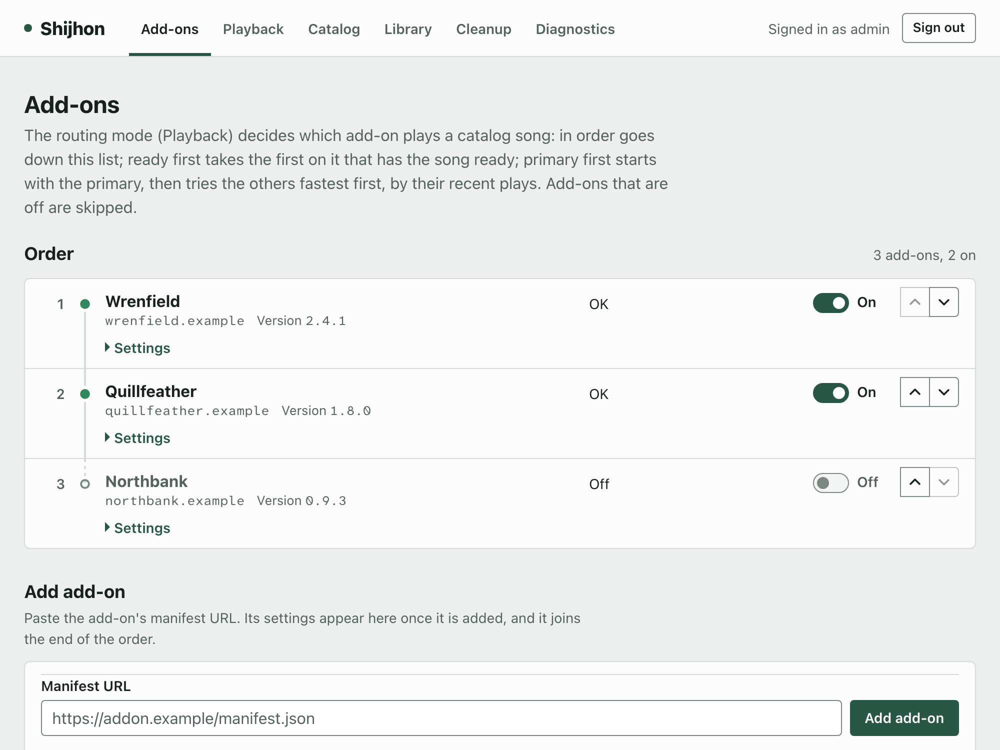
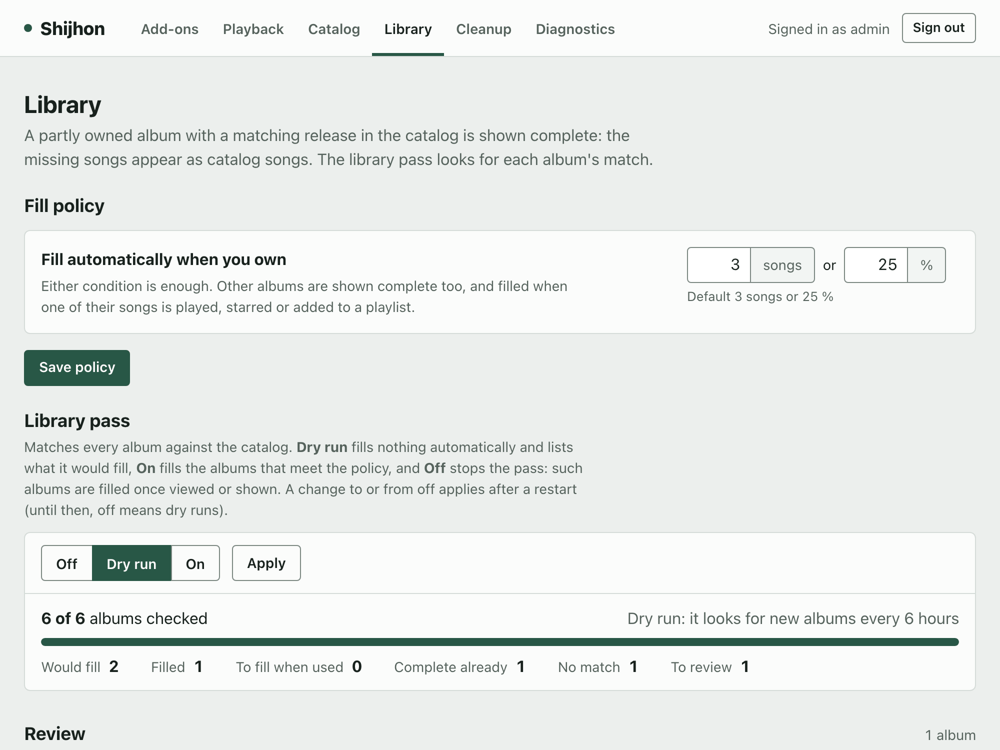
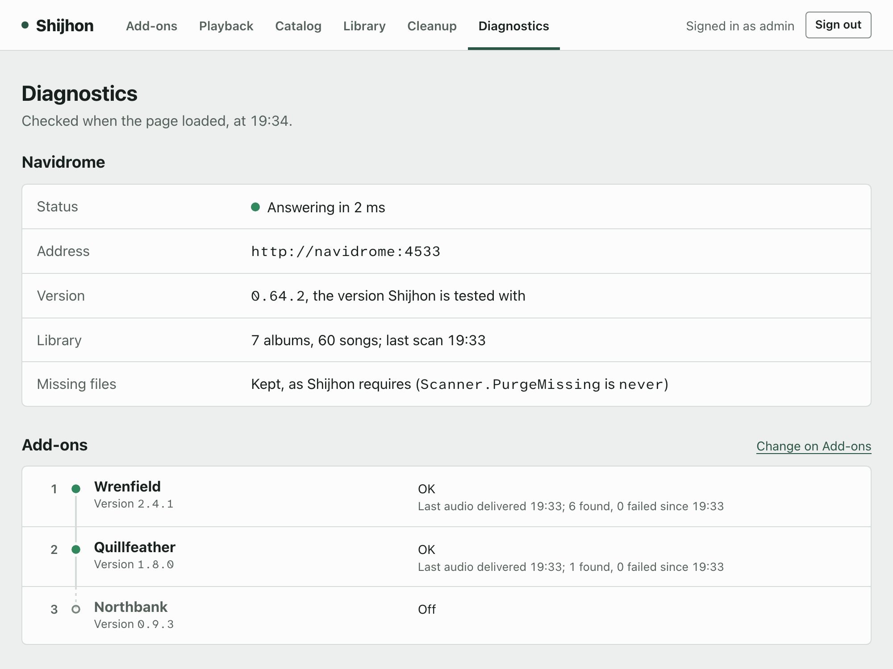

# Shijhon

Blend your own music library with a music catalog, in the music apps you already
use. Shijhon sits in front of an unmodified [Navidrome](https://www.navidrome.org/) and
adds the catalog to what your apps see.

<p>
  <a href="docs/images/dashboard-addons-light.png"><picture><source media="(prefers-color-scheme: dark)" srcset="docs/images/dashboard-addons-dark.png"></picture></a>
  <a href="docs/images/dashboard-library-light.png"><picture><source media="(prefers-color-scheme: dark)" srcset="docs/images/dashboard-library-dark.png"></picture></a>
  <a href="docs/images/dashboard-diagnostics-light.png"><picture><source media="(prefers-color-scheme: dark)" srcset="docs/images/dashboard-diagnostics-dark.png"></picture></a>
</p>

## What it is

```text
your Navidrome / Subsonic apps ──► Shijhon ──► Navidrome ──► your music library
                                      ├──► a catalog    (search, artists, albums)
                                      └──► add-ons      (audio for catalog tracks)
```

- Search results and artist pages include catalog releases next to your own albums.
- An album you have only part of shows as one complete album, once it is matched with the
  catalog.
- Catalog tracks play through your add-ons. Once you use one, it becomes a normal
  Navidrome track: favorites, playlists, ratings and scrobbling work as for your own
  files.

Navidrome stays in charge of users, the library, IDs, playlists, favorites and
scrobbling, and runs unmodified. Shijhon is not a music server, a listening app or a
transcoder. It includes no add-ons and no catalog: you add the ones you use. It is built
and tested for music; other audio organized as releases of tracks is untested
([known issues](docs/known-issues.md#audio-other-than-music)).

## Install

You need Docker with Compose, and a music folder in which Shijhon may create its
placeholder folder, `_shijhon`. Then:

```sh
git clone https://github.com/Jasshl/shijhon && cd shijhon
./setup.sh
```

The script asks where your music is and for a username and a password for your own
account, starts Navidrome and Shijhon, and prints the address your apps connect to. On
Windows, run it inside WSL. Then add a catalog ([catalogs](docs/catalogs.md)) and
add-ons ([add-ons](docs/add-ons.md)); without an add-on, catalog tracks show but do not
play.

## Documentation

- [Quick start](docs/quick-start.md): the setup, connecting your apps, the same steps by
  hand.
- [How it works](docs/how-it-works.md): placeholders, downloads, matching and the cleanup.
- [Add-ons](docs/add-ons.md) and [catalogs](docs/catalogs.md).
- [Configuration](docs/configuration.md): the settings, the command line, the dashboard.
- [Deployment](docs/deployment.md): an existing Navidrome, reverse proxies, backups,
  upgrades.
- [Privacy and security](docs/privacy-and-security.md) and
  [known issues](docs/known-issues.md).
- Reference: [the other settings](docs/reference/settings.md),
  [the add-on protocol](docs/reference/add-on-protocol.md),
  [advanced deployment](docs/reference/advanced-deployment.md),
  [known gaps](docs/reference/known-gaps.md).
- [Development](docs/development.md) and [CONTRIBUTING.md](CONTRIBUTING.md).

## Status

Shijhon is in beta (0.1.0b1), tested with Navidrome 0.64.2. The configuration and the
database can change between beta versions; the database migrates itself at startup, so
keep a backup from before an upgrade. What changed is in [CHANGELOG.md](CHANGELOG.md).

## License and credit

Shijhon is free software: Copyright (C) 2026 Jasshl, under the **GNU Affero General Public
License, version 3 or (at your option) any later version** ([LICENSE](LICENSE)). In short:
you may use, study, change and share it; if you share a changed version, or run one for
other people over a network, you must offer them its source under the same license. There
is no warranty.

One additional term applies, as section 7(b) of the license allows: a modified version
must keep the author attribution and the source notice shown in the dashboard's footer.
[NOTICE](NOTICE) has its wording, the licenses of what Shijhon depends on, and what
someone who publishes a built image has to include with it.

The license covers Shijhon only. It places no requirement on add-ons, which are separate
programs, and an independent catalog adapter - one that contains no code copied from
Shijhon - may be under any license, open or not. [NOTICE](NOTICE) contains that
permission. It covers only Shijhon's own code: the third-party components Shijhon runs
with keep their own licenses.

Credit: Shijhon is built on [Navidrome](https://www.navidrome.org/), which it runs
unmodified and whose behavior it matches, and on the
[OpenSubsonic](https://opensubsonic.netlify.app/) API. For add-ons it uses existing
protocols instead of a new one: the one [Eclipse Music](https://eclipsemusic.app/docs)
uses, and [BitChord](https://bitchord.kushagrasingh.in/docs)'s close variant of it.
Shijhon is an independent project, not affiliated with or endorsed by Eclipse Music or
BitChord.
