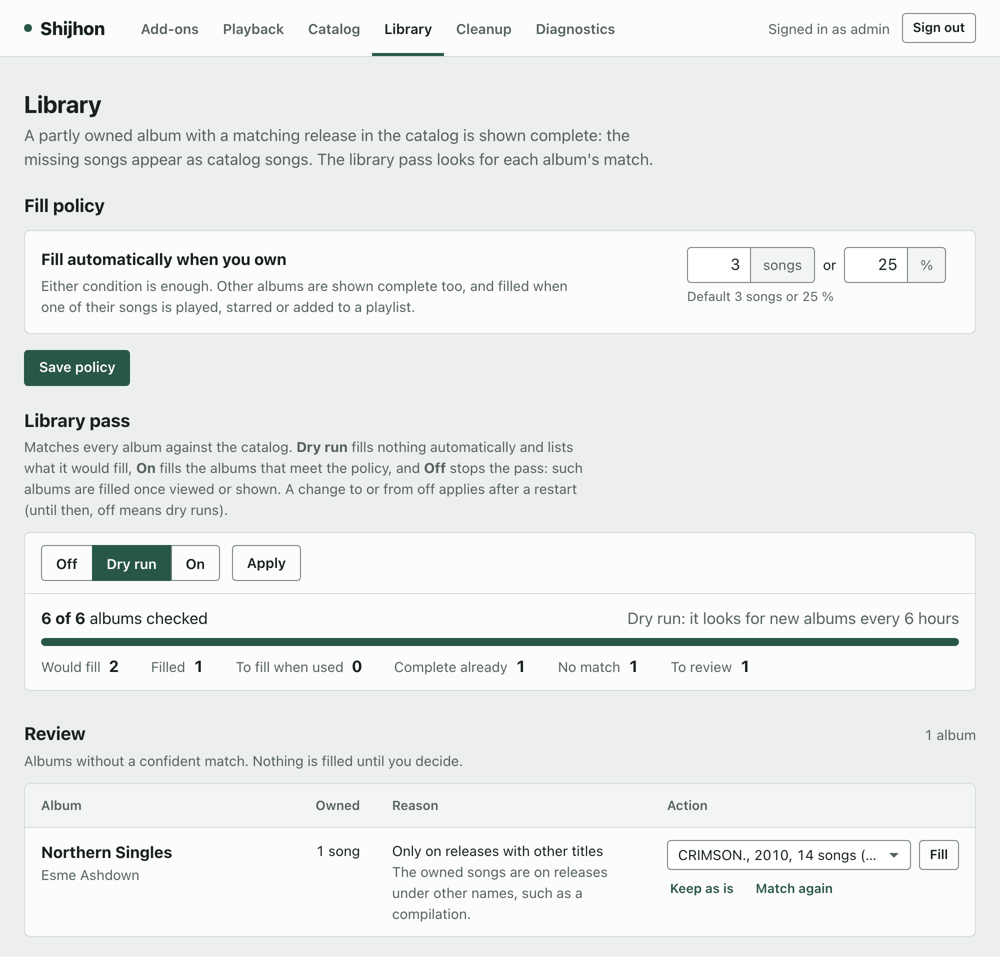

# Configuration

Shijhon reads one TOML file (`--config`; `/config/shijhon.toml` in the image). Start from
[`packaging/shijhon.example.toml`](../packaging/shijhon.example.toml).

## Which value applies

Lowest first:

1. the built-in default;
2. the configuration file;
3. a value saved on the dashboard (the `[delivery]`, `[catalog]`, `[fill]` and
   `[cleanup]` settings, `[search] budget_seconds`, and the add-ons);
4. an environment variable. The dashboard shows such a setting locked, with the variable's
   name.

Environment variables are named `SHIJHON_<SECTION>__<KEY>`, for example
`SHIJHON_NAVIDROME__URL`; top-level keys have no section (`SHIJHON_STATE_DIR`). A list is
JSON (`SHIJHON_SERVER__TRUSTED_PROXIES='["127.0.0.0/8"]'`), and so is the add-on list
(`SHIJHON_ADDONS`). With Compose, they go under the `shijhon` service's `environment:`;
the variables in `.env` only fill in the Compose file. A value outside a setting's limits
is refused at startup, with a message that names the setting.

## Settings saved on the dashboard

- They are kept in Shijhon's database, secrets included. Saving the value the file or the
  default gives removes the saved one, so a later change to the file applies again.
- Most take effect immediately. The pages mark the ones that apply after a restart, and
  offer **Restart Shijhon** while one waits.
- `shijhon saved --clear <section>[.<key>]` removes them; after a restart the file's values
  or the defaults apply again ([more](reference/settings.md#settings-saved-on-the-dashboard)).

## The settings

The ones most people change, with defaults in brackets.
[The settings reference](reference/settings.md) has all the others.

### Navidrome and the library

| Setting | What it sets |
|---|---|
| `[navidrome] url` | Navidrome's address, as Shijhon reaches it |
| `[navidrome] user`, `password` or `password_file` | The service account: a Navidrome admin account used only by Shijhon |
| `[navidrome] library_id` (1), `library_path` | The library that holds your music, and where Shijhon sees it on disk |
| `[navidrome] usage_export_path` | The usage export, which the cleanup reads ([deployment.md](deployment.md#the-usage-export)) |
| `[server] trusted_proxies` (loopback) | The reverse proxies whose `X-Forwarded-For` is trusted ([deployment.md](deployment.md#network-and-reverse-proxy)) |

`[[addons]]` is in [add-ons.md](add-ons.md#adding-an-add-on).

### `[delivery]`

On the dashboard's Playback page; `delivered_days` and `delivered_gb` on its Cleanup page.

| Setting | What it sets |
|---|---|
| `routing` (`ordered`), `primary_source`, `reliable_source` | How an add-on is picked for a song ([add-ons.md](add-ons.md#routing)); the two names are add-ons' names |
| `budget_seconds` (9) | The time allowed until audio starts, including one fallback. With `primary_first` the primary may use all of it, and the fallbacks get a budget of their own. An add-on can have its own |
| `max_wait_seconds` (30) | The longest an app waits for the first audio, all tries together. At least `budget_seconds`; keep it below the apps' own timeouts |
| `delivered_days` (30), `delivered_gb` (10) | After this many days unused, downloaded audio is replaced by its silent placeholder again. Once all of it together is larger than this size, the least recently used is replaced first. 0: no age limit, or no size limit; with both 0 it is kept for good |
| `dash_quality_from` (`"any"`), `dash_quality_to` (`"lossless"`) | Of the qualities a DASH manifest offers, the highest in this range: `"128"`, `"192"`, `"256"`, `"320"` (kbit/s) or `"lossless"`; the lower end may also be `"any"`, and may not be above the upper |

The limits per add-on and per user are in [add-ons.md](add-ons.md#limits).

### `[catalog]` and `[search]`

On the dashboard's Catalog page.

| Setting | What it sets |
|---|---|
| `kind` (`none`) | The name of an installed catalog adapter ([catalogs.md](catalogs.md)), whose own settings go in this section too. `addon`: the catalog of one of your add-ons, named by `addon` |
| `twins` (`explicit`) | Which of the clean and explicit versions of an album or song are shown: `explicit`, `clean` or `both` |
| `[search] budget_seconds` (8) | The longest a search, the page of an artist in your library or an artist's top songs waits for the catalog ([catalogs.md](catalogs.md#a-catalog-that-answers-slowly)). 120 at most |

### `[fill]` and `[cleanup]`

On the dashboard's Library and Cleanup pages. [how-it-works.md](how-it-works.md) says what
filling and the cleanup do.

| Setting | What it sets |
|---|---|
| `[fill] enabled` (on) | Matching and filling of albums that are partly in your library |
| `[fill] library_pass` (`dry_run`) | The pass over the whole library: `dry_run`, `on` or `off` |
| `[fill] auto_min_songs` (3), `auto_min_share` (0.25) | The fill policy: an album is filled automatically when you have at least this many of its songs, or this share of its tracks. 1 song: every album |
| `[cleanup] mode` (`off`) | `off`; `dry_run`: the daily check logs what it would take out; `on` |
| `[cleanup] unused_days` (30) | A release nobody has used is taken out this many days after it was added |
| `[cleanup] catalog_albums` (on), `fills` (on) | Which releases: catalog albums added to the library, and the songs added to partly owned albums |

## The command line

`--config <file>` goes before the command. In the running container:
`docker compose exec shijhon shijhon --config /config/shijhon.toml matches`.

- `shijhon serve`: runs Shijhon.
- `shijhon matches`: lists the album matches and the review list; `--all` also lists
  complete albums and those without a match. It changes nothing, and reads only Shijhon's
  database, so it also lists albums of other catalogs and regions, and ones no longer in
  the library.
- `shijhon cleanup`: lists what the cleanup would take out now, what it keeps, and why. It
  changes nothing, and needs `usage_export_path` or `database_path`.
- `shijhon saved`: the settings saved on the dashboard, secrets hidden;
  `--clear <section>[.<key>]` removes them.
- `shijhon catalogs`: the installed catalog adapters.
- `shijhon fills-undo`: lists the automatic fills the fill policy would not make now;
  `--apply` undoes those nobody used, with Shijhon stopped
  ([advanced deployment](reference/advanced-deployment.md#undoing-automatic-fills)).
- `shijhon usage-export`: writes the usage export (the Compose file runs it as a service).
- `shijhon version`.

## The dashboard

At `/shijhon/` on Shijhon's address, for Navidrome admins. The pages work without
JavaScript. Each page shows the settings most people change first, the rest under **More settings**.

- **Add-ons**: add, order, enable, disable or remove add-ons, and their settings.
- **Playback**: the `[delivery]` settings.
- **Catalog**: which catalog is used, and its settings.
- **Library**: the fill policy, the library pass and the **review list**: albums whose
  match needs a decision. Fill one from a release you choose, keep it as it is, or match
  it again.
- **Cleanup**: what Shijhon added, the cleanup's settings, what its last check took out
  or would take out, and the limits for downloaded audio. A change that lets it take out
  more first shows what the next check would take out.
- **Diagnostics**: Navidrome, the add-ons, the catalog, versions, recent errors, and
  **Restart Shijhon**.
- **Appearance** (linked from the footer): the dashboard's colors.

<picture>
  <source media="(prefers-color-scheme: dark)" srcset="images/dashboard-library-review-dark.png">
  
</picture>

<picture>
  <source media="(prefers-color-scheme: dark)" srcset="images/dashboard-diagnostics-dark.png">
  
</picture>
